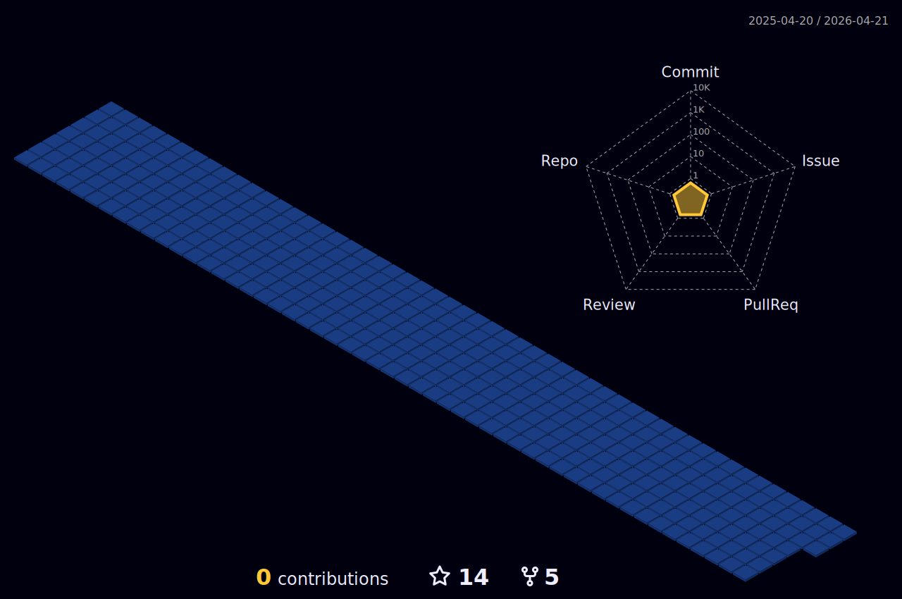

<h1 align="center">Hi 👋, I'm Krish Dholeria</h1>
<h3 align="center">A Passionate Software Engineering Student Crafting Code for Tomorrow's Innovations</h3>

  

- 🔭 I’m currently working on **an Online Banking system**

- 🌱 I’m currently learning **AI/ML and Docker**

- 💬 Ask me about **Nextjs, JAVA, Spring Boot**

- 📫 How to reach me **krishdholeria1@gmail.com**

<h3 align="left">Connect with me:</h3>

<h3 align="left">Languages and Tools:</h3>

                            

&nbsp;

  

